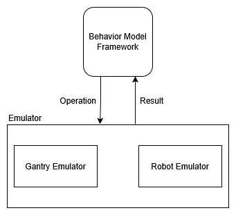

## An R2R emulator for ROS2

1. Source ROS workspace with `source /opt/ros/<distro>/setup.bash`
2. Build with `colcon build` in a workspace to build the custom msgs
3. Source the workspace with `source install/setup.bash`
4. Navigate to the `emulator` folder
5. Run with `cargo run`

## Architecture:


## Features:
We emulate two resources, a robot and a gantry. These resources can perform some dummy actions, move, calibrate, lock, unlock for the gantry, and move, pick, place, mount, unmount, check_mounted_tool for the robot. In reality, problems arise during execution so these actions can fail and timeout. To emulate such failures and timeouts, we can send a nested Emulation message in the command request to the nodes, forcing them to fail or timeout. This helps us develop the initial behavior model much easier, without the need of connecting to real equipment or simulations.  

## How is this useful:
Exchange the emulation with the real resource driver or simulation, and update the model and interfaces. Enables quicker iterations of behavior models.

## Failure Emulation:
To disable all failure emulation and test only for nominal behavior, set all emulation values to 0.

To emulate failure, inject emulation state like this (gantry example):
```
let new_state = state
    .update("gantry_emulate_execution_time", 2.to_spvalue())
    .update("gantry_emulated_execution_time", 3000.to_spvalue())
    .update("gantry_emulate_failure_rate", 2.to_spvalue())
    .update("gantry_emulated_failure_rate", 30.to_spvalue())
    .update("gantry_emulate_failure_cause", 2.to_spvalue())
    .update(
        "gantry_emulated_failure_cause",
        vec!["violation", "collision", "detected_drift"].to_spvalue(),
    );

    let modified_state = state.get_diff_partial_state(&new_state);
    command_sender
        .send(Command::SetPartialState(modified_state))
        .await?;
```
where:
```
# DONT_EMULATE_EXECUTION_TIME: The action will be executed immediatelly
# EMULATE_EXACT_EXECUTION_TIME: The action will always take "emulate_execution_time" amount of time
# EMULATE_RANDOM_EXECUTION_TIME: The action will randomly take between 0 and "emulated_execution_time" amount of time
uint8 DONT_EMULATE_EXECUTION_TIME = 0
uint8 EMULATE_EXACT_EXECUTION_TIME = 1
uint8 EMULATE_RANDOM_EXECUTION_TIME = 2
uint8 emulate_execution_time
int32 emulated_execution_time # milliseconds

# DONT_EMULATE_FAILURE: The action will be execute succesfully every time
# EMULATE_FAILURE_ALWAYS: The action will always fail
# EMULATE_RANDOM_FAILURE_RATE: The action will randomly fail with a "emulated_failure_rate" rate
uint8 DONT_EMULATE_FAILURE = 0
uint8 EMULATE_FAILURE_ALWAYS = 1
uint8 EMULATE_RANDOM_FAILURE_RATE = 2
uint8 emulate_failure_rate
int32 emulated_failure_rate # percentage 0..100

# DONT_EMULATE_FAILURE_CAUSE: If the action fails, it wil fail with a generic "fail" cause
# EMULATE_EXACT_FAILURE_CAUSE: Specify why the exact reason why the action fails (takes the first from the "emulated_failure_cause" list)
# EMULATE_RANDOM_FAILURE_CAUSE: The action will fail and randomly choose a cause from the "emulated_failure_cause" list
uint8 DONT_EMULATE_FAILURE_CAUSE = 0
uint8 EMULATE_EXACT_FAILURE_CAUSE = 1
uint8 EMULATE_RANDOM_FAILURE_CAUSE = 2
uint8 emulate_failure_cause
string[] emulated_failure_cause # For example: ["violation", "timeout", "collision", etc.]
```

## Acknowledgements:

Thank you to Endre Erős and Volvo Trucks for letting us use their emulator for micro_sp as a base for this project. 